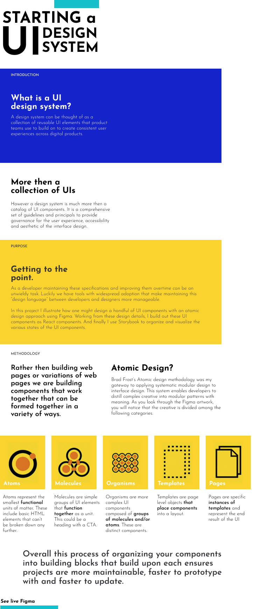
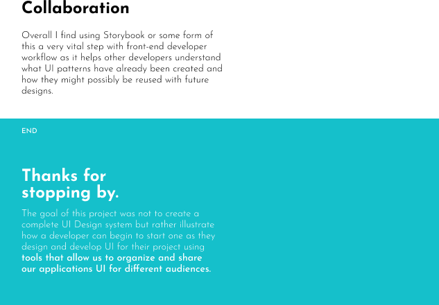

# Figma to Storybook

| Figma Section | Link |
| ------ | ------ |
| Main | [main](https://www.figma.com/file/5R8kZDBSWYGCuwQjLox0oV/mockup-to-UI?type=design&node-id=0%3A1&mode=design&t=yAD7ujmGj3INbiV9-1) | 
| Atoms | [atoms section](https://www.figma.com/file/5R8kZDBSWYGCuwQjLox0oV/mockup-to-UI?type=design&node-id=0%3A1&mode=design&t=yAD7ujmGj3INbiV9-1) | 
| Molecules | [molecules section](https://www.figma.com/file/5R8kZDBSWYGCuwQjLox0oV/mockup-to-UI?type=design&node-id=0%3A1&mode=design&t=yAD7ujmGj3INbiV9-1) | 
| Organisms | [organisms section](https://www.figma.com/file/5R8kZDBSWYGCuwQjLox0oV/mockup-to-UI?type=design&node-id=0%3A1&mode=design&t=yAD7ujmGj3INbiV9-1) | 
| Templates | [templates sections](https://www.figma.com/file/5R8kZDBSWYGCuwQjLox0oV/mockup-to-UI?type=design&node-id=0%3A1&mode=design&t=yAD7ujmGj3INbiV9-1) | 
| Pages | [pages section](https://www.figma.com/file/5R8kZDBSWYGCuwQjLox0oV/mockup-to-UI?type=design&node-id=0%3A1&mode=design&t=yAD7ujmGj3INbiV9-1) | 

 
 

| Storybook Section | Link |
| ------ | ------ |
| Main | [Storybook](https://bournecreative.github.io/figma-to-storybook/?path=/docs/components-button--docs)| 

 
 

