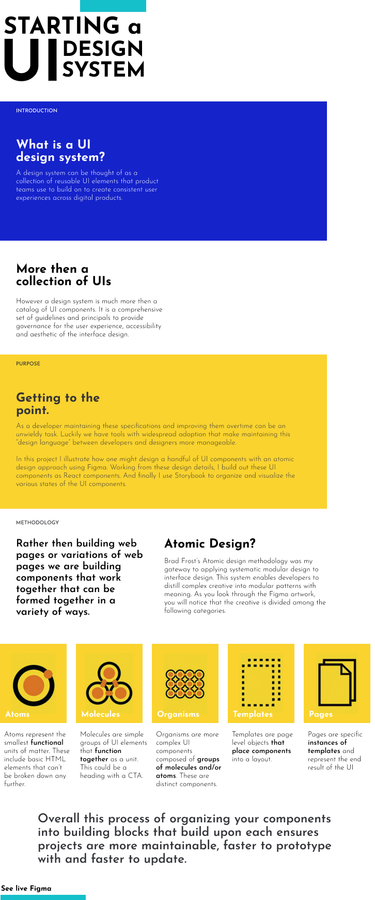
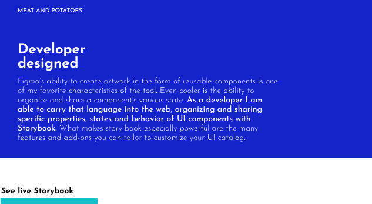
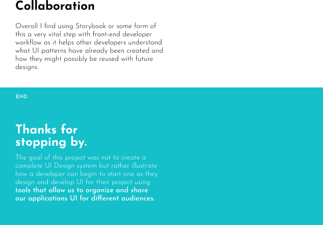

# Figma to Storybook

This project is a simple but hopefully clear example that illustrates how UI designs created in Figma can be translated into patterns and built into web UI using Atomic Design principals. The main take away is that the designers maintain their concepts of UI in figma while developers maintain their ecosystem of UI in Storybook, yet the design language is maintained and can be easily communicated.

Components have been created with React.

## Project Links

| Figma Section | Link                                                                                                                               |
| ------------- | ---------------------------------------------------------------------------------------------------------------------------------- |
| Main          | [main](https://www.figma.com/file/5m9xrf9Q0HbumomLoD3k9K/Design-system?type=design&node-id=0%3A1&mode=design&t=9hFLNWJ7mONzmFcE-1) |

| Storybook Section    | Link                                                                                                                   |
| -------------------- | ---------------------------------------------------------------------------------------------------------------------- |
| Alarm Card           | [Storybook](https://bournecreative.github.io/figma-to-storybook/?path=/docs/components-alarmcard--docs)                |
| Button               | [Storybook](https://bournecreative.github.io/figma-to-storybook/?path=/docs/components-button--docs)                   |
| Hero Editorial       | [Storybook](https://bournecreative.github.io/figma-to-storybook/?path=/docs/components-heroeditorial--docs)            |
| Editorial Card Group | [Storybook](https://bournecreative.github.io/figma-to-storybook/?path=/docs/components-editorialcardgroup--three-card) |

### More about the project

The following graphics help explain Atomic design and provide some context to the process.

| Figma Section | Link                                                                                                                                               |
| ------------- | -------------------------------------------------------------------------------------------------------------------------------------------------- |
| Main          | [main](https://www.figma.com/file/5m9xrf9Q0HbumomLoD3k9K/Design-system?type=design&node-id=0%3A1&mode=design&t=9hFLNWJ7mONzmFcE-1)                 |
| Design Tokens | [design tokens section](https://www.figma.com/file/5m9xrf9Q0HbumomLoD3k9K/Design-system?type=design&node-id=3-12&mode=design&t=xsy8k1mPkUyZ5UxX-0) |
| Atoms         | [atoms section](https://www.figma.com/file/5m9xrf9Q0HbumomLoD3k9K/Design-system?type=design&node-id=49-31&mode=design&t=xsy8k1mPkUyZ5UxX-4)        |
| Molecules     | [molecules section](https://www.figma.com/file/5m9xrf9Q0HbumomLoD3k9K/Design-system?type=design&node-id=49-49&mode=design&t=dOoFi7If4s7xwsAq-4)    |
| Organisms     | [organisms section](https://www.figma.com/file/5m9xrf9Q0HbumomLoD3k9K/Design-system?type=design&node-id=50-110&mode=design&t=xsy8k1mPkUyZ5UxX-4)   |
| Templates     | [templates sections](https://www.figma.com/file/5m9xrf9Q0HbumomLoD3k9K/Design-system?type=design&node-id=36-103&mode=design&t=9Gpd2GyAhJTZZx3I-4)  |
| Pages         | n/a                                                                                                                                                |

 
 

| Storybook Section    | Link                                                                                                                   |
| -------------------- | ---------------------------------------------------------------------------------------------------------------------- |
| Alarm Card           | [Storybook](https://bournecreative.github.io/figma-to-storybook/?path=/docs/components-alarmcard--docs)                |
| Button               | [Storybook](https://bournecreative.github.io/figma-to-storybook/?path=/docs/components-button--docs)                   |
| Hero Editorial       | [Storybook](https://bournecreative.github.io/figma-to-storybook/?path=/docs/components-heroeditorial--docs)            |
| Editorial Card Group | [Storybook](https://bournecreative.github.io/figma-to-storybook/?path=/docs/components-editorialcardgroup--three-card) |

 
 

